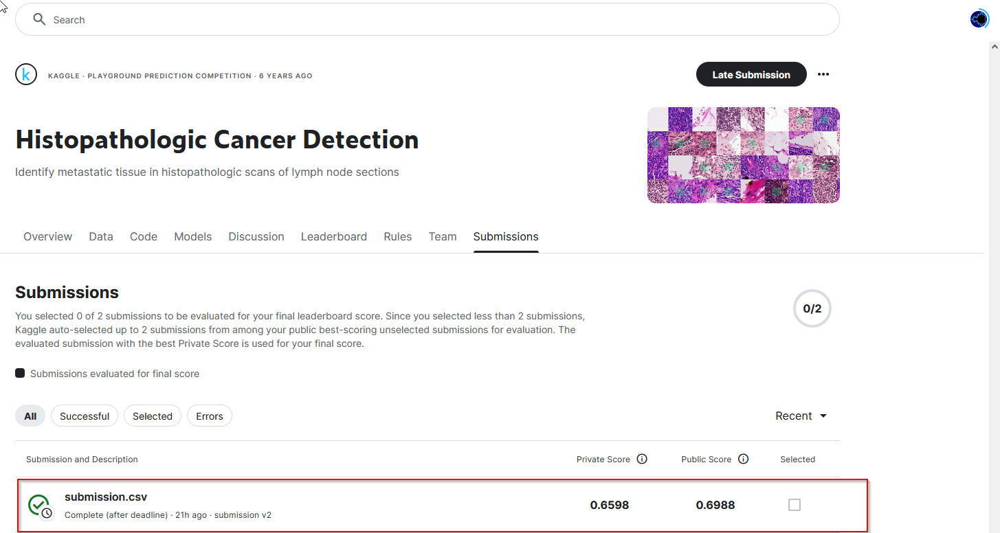

# **Histopathologic Cancer Detection Project**

University of Colorado Boulder MS-CS Deep Learning Peer-graded Assignment: Week 3: CNN Cancer Detection Kaggle Mini-Project 

## **Introduction**
This project aims to classify histopathologic images of lymph node sections to detect metastatic cancer using Convolutional Neural Networks (CNNs). The task is part of the Kaggle competition [Histopathologic Cancer Detection](https://www.kaggle.com/c/histopathologic-cancer-detection). The primary objective is to train a model capable of distinguishing between cancerous and non-cancerous images with high accuracy.

---

## **Project Structure**
The project is implemented in a **Jupyter Notebook** and structured into the following sections:

1. **Introduction**  
   - Problem overview and dataset description.
   - Description of the task and objectives.

2. **Loading and Preprocessing Data**  
   - Images and labels are loaded, preprocessed, and normalized.
   - Data is prepared for training and testing.

3. **Exploratory Data Analysis (EDA)**  
   - Visualization of label distribution.
   - Sample images and pixel intensity distribution are analyzed.

4. **Splitting the Data**  
   - Dataset is split into training and validation sets using an 80-20 split.

5. **Model Architecture and Training**  
   - A Convolutional Neural Network (CNN) is designed and trained.
   - Techniques such as dropout and data augmentation are applied.

6. **Performance Visualization**  
   - Accuracy and loss trends for both training and validation sets are plotted.

7. **Predictions and Submission**  
   - Predictions are made on the test set, and a submission file is generated for Kaggle evaluation.

8. **Discussion and Conclusion**  
   - Key results, challenges, and potential improvements are discussed.

---

## **Dataset**
The dataset is provided by Kaggle and consists of the following:
- **Training Images**: 50x50 pixel RGB images with binary labels (cancerous or non-cancerous).
- **Test Images**: Unlabeled 50x50 pixel RGB images used for prediction and evaluation.
- **Label File**: `train_labels.csv` contains the image IDs and their corresponding labels.

---

## **Results**
- **Final Kaggle Score**:
- The model achieved a consistent training and validation accuracy, demonstrating its effectiveness for binary classification of cancerous tissue.

### Kaggle Score Screenshot:


### Kaggle Submission File
The final predictions are saved in the `submission.csv` file. This file contains the following structure:
```csv
id,label
abc123,0
def456,1
ghi789,0
